# Advanced Calculator


Offline-first scientific, graphing and algebra calculator for Android and iOS,
built with Flutter. No account, no network access needed for any calculation,
and no analytics, crash reporting or ads.

## Screenshots

Real screens rendered from the app itself (`docs/screenshots/`).

| Calculator | Fractions | Equation in calculator | Scientific |
|---|---|---|---|
| 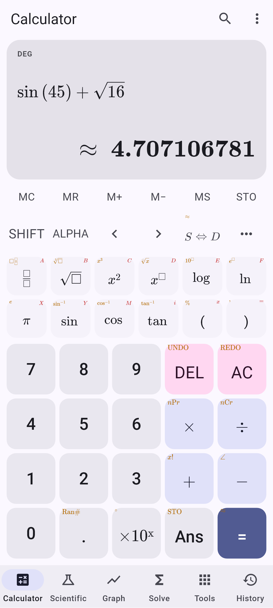 |  | 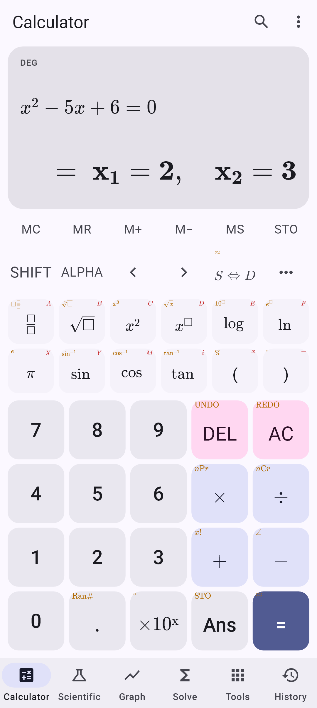 | 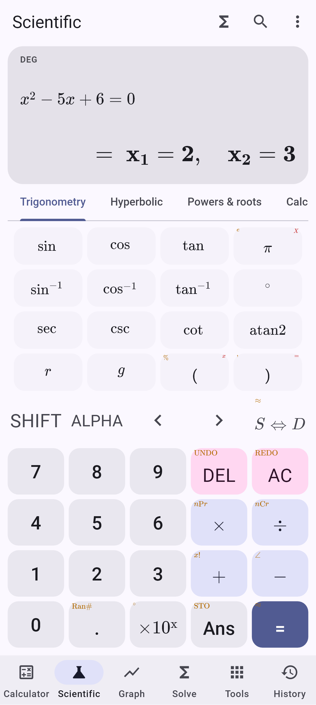 |
| **Graph** | **Solve** | **Equation solver (steps)** | **Tools** |
| 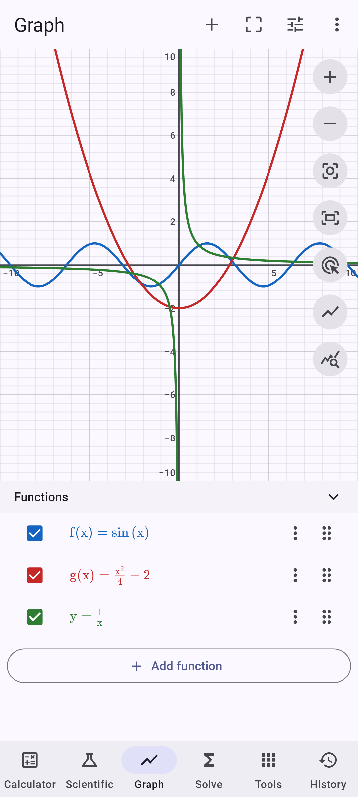 | 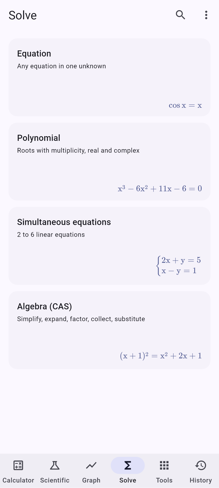 | 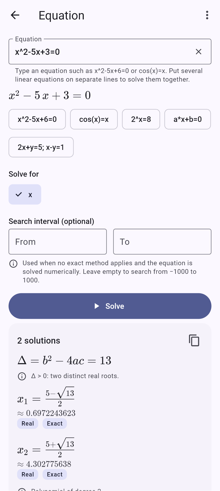 | 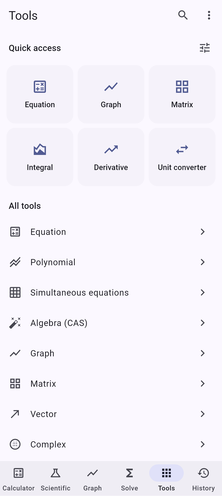 |
| **Matrix** | **Unit converter** | **Formula** | **Programmer** |
| 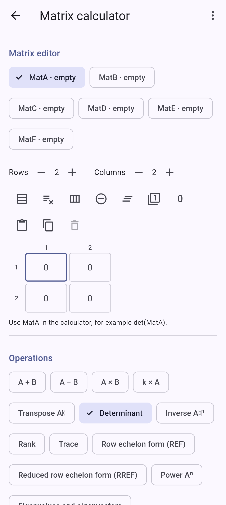 | 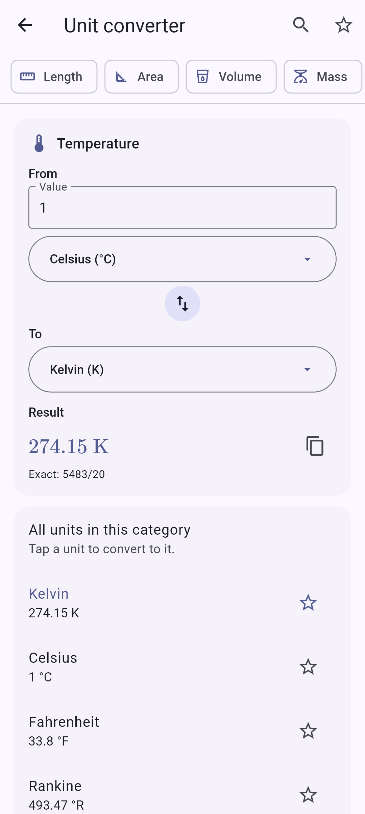 | 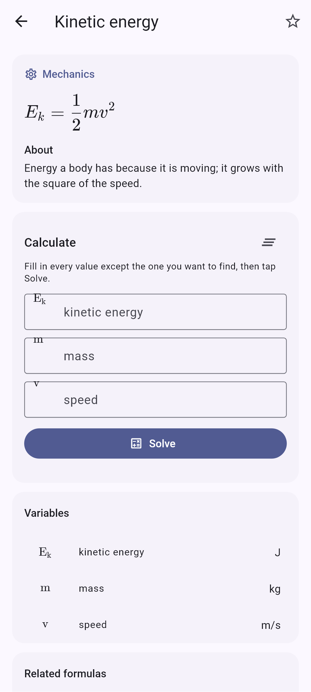 | 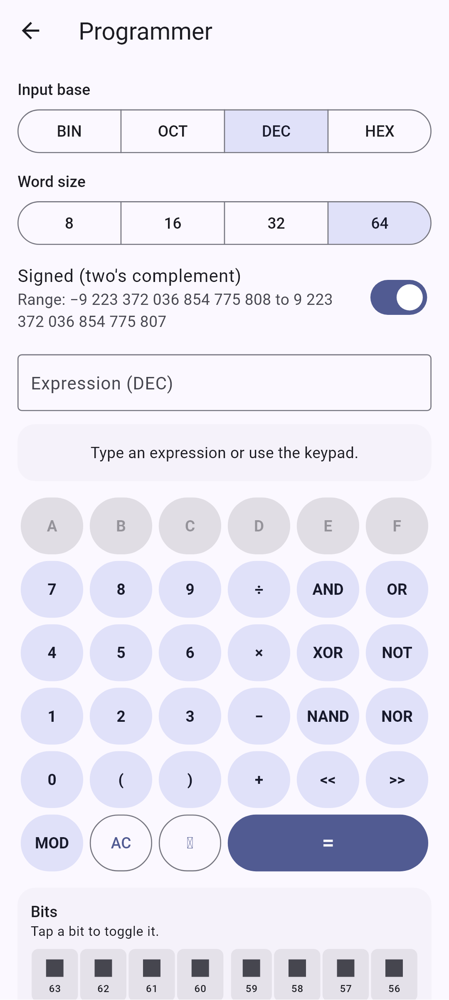 |
| **Statistics** | **Constants** | **History** | **Dark theme** |
| 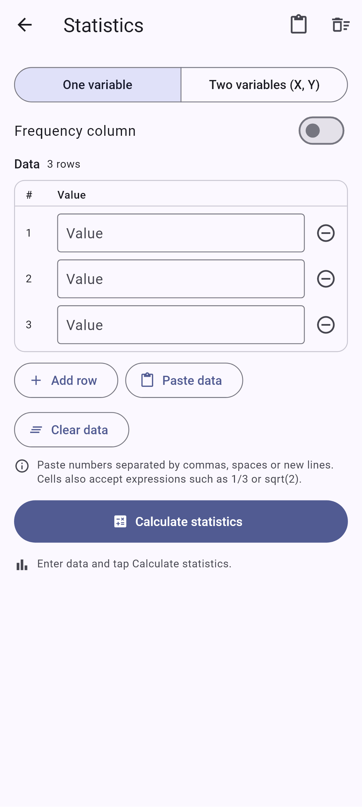 | 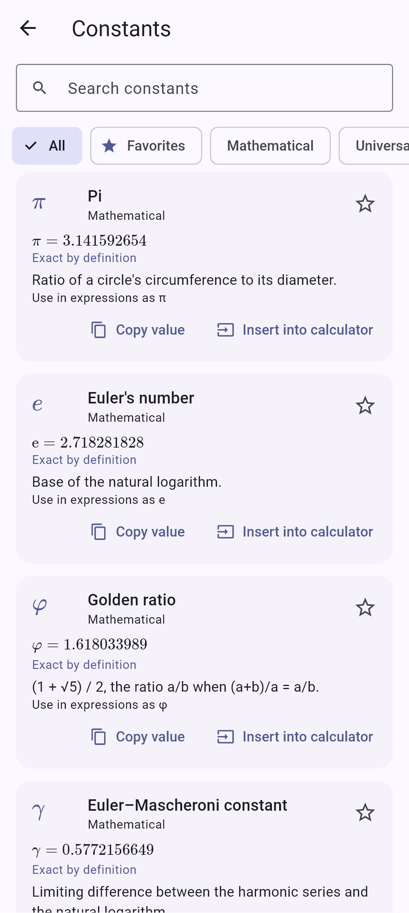 | 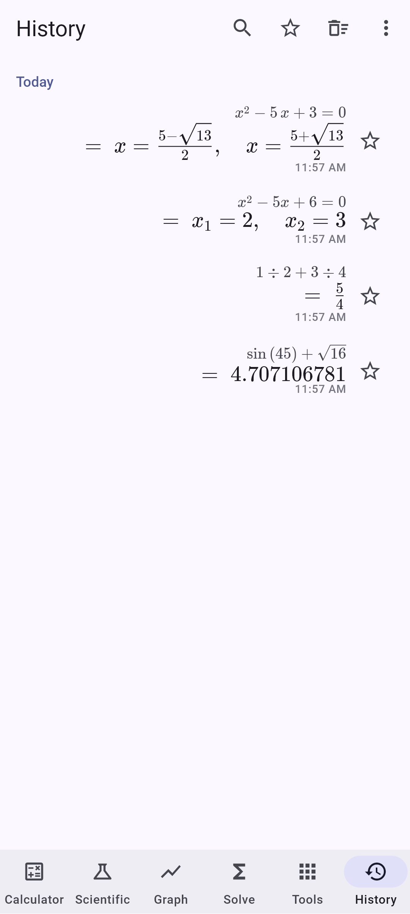 | 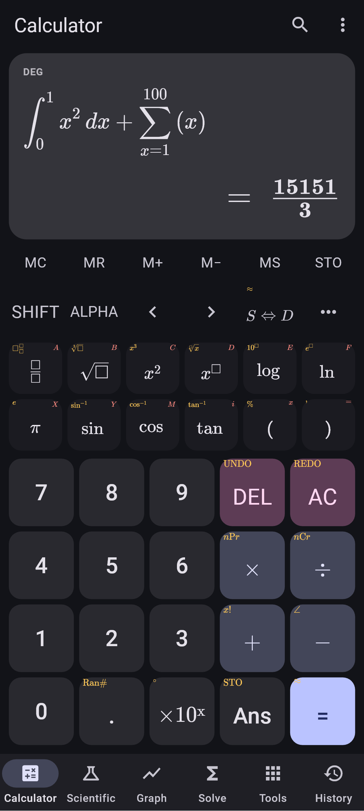 |

**Tablet layout**

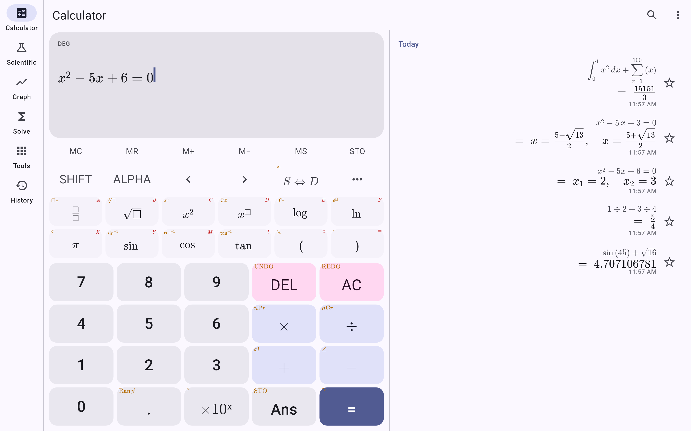

Regenerate them with:

```bash
SCREENSHOTS=1 flutter test test/screenshots/generate_screenshots_test.dart
```

## Layout

```
packages/math_engine/      Pure-Dart engine (no Flutter imports) — replaceable
  lib/src/numbers/         Exact rationals, 100-digit decimals, complex numbers
  lib/src/parser/          Tokenizer + recursive-descent parser → AST (no eval)
  lib/src/eval/            Evaluator, double compiler (graphs), value codec
  lib/src/cas/             Symbolic engine: simplify, expand, factor, collect,
                           differentiate, integrate (verified by differentiation)
  lib/src/algebra/         Polynomial roots (exact + Aberth), equation & linear-system solvers
  lib/src/calculus/        Numeric derivatives, adaptive Gauss–Kronrod, limits, Σ/Π
  lib/src/linalg/          Matrices & vectors (Bareiss det, Gauss–Jordan, eigen)
  lib/src/stats/           Statistics, regression, probability distributions
  lib/src/graph/           Adaptive sampling, discontinuities, graph analysis
  lib/src/units/, content/ Unit converter (326 units), 365 formulas, constants
lib/
  app/                     App widget, router, providers, navigation shell
  data/                    SQLite (sqflite) schema & repositories, settings store
  features/                Screens (calculator, graph, solve, tools, history…)
  services/                Isolate engine runner, backup, purchases, clipboard…
  l10n/                    ARB strings (English; architecture ready for more)
  themes/, widgets/        Material 3 themes (light/dark/AMOLED), shared widgets
```

UI → Riverpod state → `MathEngine` interface → repositories. Heavy work runs in
cancellable background isolates (`EngineService`).

## Running and testing

```bash
flutter pub get
flutter test                                   # app widget, data and LaTeX tests
cd packages/math_engine && dart test           # ~6,900 engine tests incl. mpmath oracle cases
```

`packages/math_engine/tool/gen_accuracy_cases.py` regenerates the accuracy suite
from mpmath (`test/data/accuracy_cases.json`).

On this Windows machine Gradle needs the temp-dir workaround:
`TMP='C:\gradle-tmp' TEMP='C:\gradle-tmp' flutter build appbundle --release`.

## App icon

Original artwork: an indigo tile with the four arithmetic operators drawn as
geometric strokes (no fonts or third-party assets). Everything is generated by
`tool/generate_icons.py`; full-resolution masters live in `docs/branding/`.

| File | Use |
|---|---|
|  `app_icon_1024_rounded.png` | Docs, marketing, in-app copy |
|  `app_icon_1024_square.png` | App Store (1024×1024, opaque) |
|  `play_store_icon_512.png` | Google Play listing (512×512) |
|  `adaptive_foreground_1024.png` | Android adaptive icon foreground |
|  `adaptive_background_1024.png` | Android adaptive icon background |

## Store readiness

- **Android signing:** create `android/key.properties` (git-ignored) with
  `storeFile`, `storePassword`, `keyAlias`, `keyPassword`; release builds then
  use it (otherwise they fall back to the debug key). Build the AAB with
  `flutter build appbundle --release`.
- **Icons/splash:** regenerate with `python tool/generate_icons.py`
  (adaptive + monochrome Android icons, iOS icon set, splash logo).
- **iOS:** `ios/Runner/PrivacyInfo.xcprivacy` declares no tracking and no
  collected data; add it to the Runner target in Xcode (Build Phases → Copy
  Bundle Resources) before archiving. Configure the StoreKit product.
- **In-app purchase:** one non-consumable product `advanced_calculator_premium`
  (Play Console + App Store Connect). Premium only unlocks extra accent themes
  and more than 12 saved functions/graphs; every calculator stays free. The
  entitlement is stored in the Keystore/Keychain and re-confirmed with Google
  Play on launch. There is no server-side receipt validation.
- **Data safety / privacy labels:** no data collected or shared; no ads; no
  analytics; purchases handled by the store. Privacy text lives in the app
  (Settings → Privacy); publish the same text as the privacy-policy URL.
